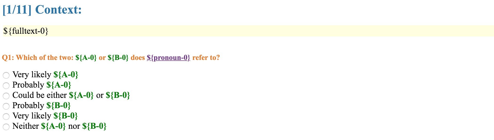

# Homework 3 -- Mechanical Turk Instructions

In this part of the homework, you will:
1. Create a sample mechanical turk task (without running it!!!!)
1. Analyze crowdworker annotations that we collected on our version of the task

## Creating a Sample Mechanical Turk Task

First, go to http://requester.mturk.com to create a requester account. Please do this ASAP. If you have any problems here, please contact an instructor immediately.

Now, you can create a *Project* for annotating coreference links. In particular, we are interested in getting crowdworkers to annotate examples like the following:

*Text:* Clarence "Skip" Ellis was an American computer scientist, and Emeritus Professor of Computer Science and Cognitive Science at the University of Colorado at Boulder. After graduating from Beloit, Ellis enrolled in MIT for graduate school, but only stayed a short time because of his civil rights activism. He eventually attended graduate school at the University of Illinois at Urbana-Champaign, where he worked on hardware, software, and applications of the ILLIAC IV supercomputer. In 1969, *Clarence Ellis* earned a Ph.D. in computer science from UIUC, becoming the first African-American to do so. *His* Ph.D. advisor was *David E. Muller*.

*Question:* Does *His* refer to *Clarence Ellis* or to *David E. Muller* (or neither)?

*Desired Answer:* Clarence Ellis

We have provided (on Canvas, see the link in HW3) a dataset on which to do this (PLEASE keep this dataset confidential and do not share). Because it is often useful to give crowdworkers a larger number of examples to work on at the same time (to keep the overhead cost down), each HIT (mturk-speak for "annotation item") contains TEN such examples. 

Here is a part of the headline of the dataset csv file: 

| ident-0  | A-0 | B-0 | pronoun-0 | name_a_coref-0 | name_b_coref-0 | fulltext-0 |
| --- | --- | --- | --- | --- | --- | --- |

*Ident* is the ID of the example. *A, B* are the two name entities, while *pronoun* is the pronoun. *Name_a_coref, name_b_coref* indicates whether the pronoun refers to A or B respectively. *Fulltext* is the context. Note there is a *0* attached to all the attribute names. It indicates this is the 0th example in the HIT. Thus for the above example, the tuple is

| ident-0  | A-0 | B-0 | pronoun-0 | name_a_coref-0 | name_b_coref-0 | fulltext-0 |
| --- | --- | --- | --- | --- | --- | --- |
| someID | Clarence Ellis | David E. Muller | his | True | False | Clarence "Skip" Ellis was ...His Ph.D. advisor was David E. |

To create a HIT, log in to your mturk account, and:

1. Under "Create", select "New Project" to create a new project.
1. You will create a task from scratch, so under "Other" select "Other" and then hit "Create Project"
1. Give your project a description name, title, and keywords. For now, set the Reward per Assignment to $1 -- you will revisit this later after you time yourself on the task; you can leave everything else at its default, and go on to "Design Layout."
1. First, you will need to write some instructions both in short-summary form and in detailed-instructions form. Consider this to be the annotation guidelines that you provide to the crowdworkers. Write something that you think best explains the task in a way that a crowdworker will understand. You can also provide an example or two that are good and bad.
1. Now, you need to design the main part of the HIT. For this, you'll need to display the text, highlight the relevant words (pronoun, and the two names). Note that you'll need to include TEN examples, not a single example, on a single hit. This will need to refer to items in the input CSV file. To refer to a specific column in the CSV file, you write `${column_name}`. Create ten examples, where you provide the text, and ask which of the two names the pronoun refers to, with the scale: Very likely A, Probably A, Could be either A or B, Probably B, Very likely B, Neither A nor B. An example of how this might look is: 
1. You can go back and forth between designing the layout and previewing it until you are satisfied. At that point, you can save the results.
1. Now, go back to the "Create" tab, and click "Publish Batch" next to your new HIT. It should ask you to upload a CSV file (if it doesn't, it's probably because you didn't include any fields like `${...}` in your HIT). Upload the input CSV file that we provided; if it complains about mismatched columns, you probably did not use the correct column names.
1. You will now be able to preview the HIT with the actual data! Now, we need to figure out how much to pay and how long to allow for the task. Do the first three pages by yourself (in the "real world" we could also use this as "test data" for annotators) and time yourself. (Write down how long it took.) Divide this number by three to get an estimate of how long it will take on average. Compute a reward per task so that---if a Turker spent the same amount of time as you---they would be paid $12/hr. Go back and change the reward to that amount, and change the duration of the task to be ten times that amount.
1. Now, go back to previewing the task, with the uploaded data. Take three screenshots for us. One should be with the "detailed instructions" showing, one should be with the top of the page showing, and one should be with the bottom (last HIT) of the page showing. Try to zoom out a reasonable amount so we can see as much as possible.

Whatever you do during this, *do not say Publish* because then it will start charging you :). (It should be pretty obvious, and if you haven't provided methods of payment, then this shouldn't be a problem.)

## Evaluating Crowdworker Annotations

We have also provided annotation results from crowdworkers on our own version of this HIT (also on Canvas, also PLEASE do not share). If you download this data, you will see a csv file. In this file, the first couple columns are some properties of this annotation task, which you can ignore for now in this assignment. Following that is a recap of corresponding input data in this HIT. Finally, the last part is the annotation result. For the [i]th example, the result includes the following attributes

| Answer.ident[i] | Answer.radios[i]0.1 | Answer.radios[i]0.2 | Answer.radios[i]0.3 | Answer.radios[i]0.4 | Answer.radios[i]0.5 | Answer.radios[i]0.6 |
| -- | -- | -- | -- | -- | -- | -- |

*Answer.ident* is the ID, whose value should match with the input ID of this example. Then *Answer.radios[i]0.[x]* is whether the xth choice has been chosen by the annotator. 

This is (more or less) exactly what you might get if you ran your task. (Note: the two datasets are actually somewhat different---the annotations we're giving you don't exactly match the inputs we're giving you, but that's not an issues for this assignment.)

For answering the quiz questions related to this part of the assignment, we highly recommend you do this by code not by hand, though we don't require you to hand in the code, so write in whatever language(s) you feel most comfortable with.
